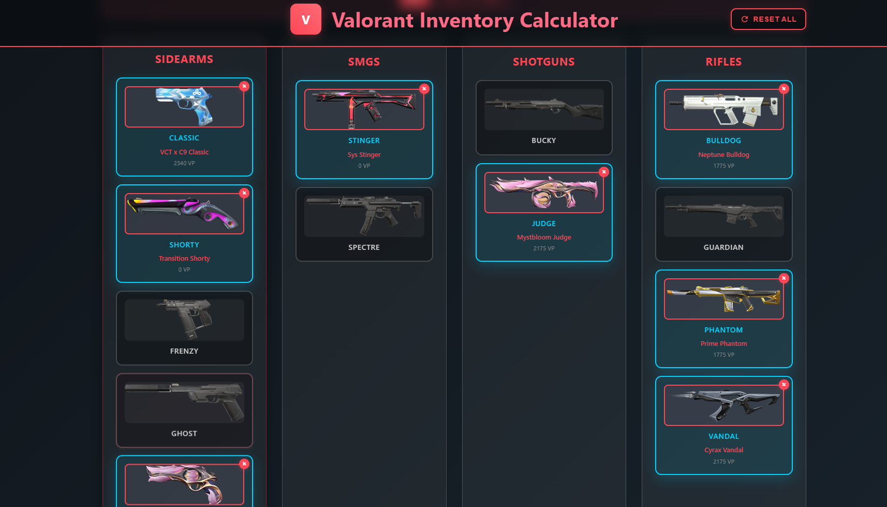
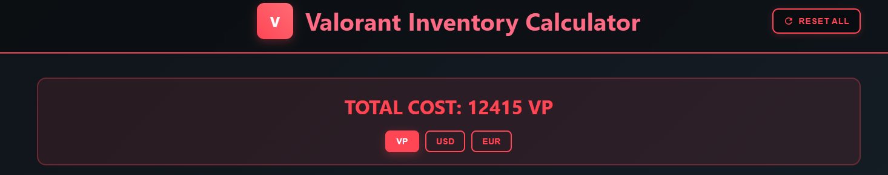

# 💎 Valorant Inventory Calculator 💎

A web application that allows users to calculate the total cost of their dream Valorant skin collection across all weapons in the game.

## ℹ️ About

The **Valorant Inventory Calculator** is a comprehensive tool designed for Valorant players 🎮 who want to plan and budget their skin purchases. Users can browse through all available weapon skins 🔫 in the game, select their preferred skin for each weapon ✨, and instantly see the total cost in Valorant Points (VP), USD 💵, and EUR 💶.

Whether you're a casual player looking to treat yourself to a few skins or a collector aiming for the complete set 🏆, this calculator helps you understand the financial commitment required for your desired inventory.

**Key Features:**
- 📖 Complete catalog of all Valorant weapon skins
- 🎨 Interactive skin selection for every weapon in the game
- ⏱️ Real-time cost calculation in multiple currencies (VP, USD, EUR)
- 🧩 Clean and intuitive user interface
- 📱 Responsive design for desktop and mobile devices

## 🖥️ Demo

### 🗂️ Main Interface

*Browse and select skins for each weapon category*

### 💰 Cost Summary

*View your total investment across different currencies*

**⚠️ Disclaimer: The website may occasionally be down due to server maintenance or hosting limitations. If you encounter any issues accessing the site, please try again later.**

## 🛠️ Tech Stack

### 🎨 Frontend
- **HTML5** - Structure and markup
- **CSS3** - Styling and responsive design
- **JavaScript** - Interactive functionality and API communication
- **GitHub Pages** - Static site hosting

### ⚙️ Backend
- **Java** - Core programming language
- **Spring Boot** - Web application framework
- **Render** - Cloud hosting platform for the backend API
- **Docker** - Dockerfile

### 🗄️ Database
- **Supabase** - PostgreSQL database hosting and management

### 🏗️ Architecture
- **RESTful API** - Communication between frontend and backend
- **Responsive Design** - Mobile-first approach for cross-device compatibility

## 🚀 Getting Started

Visit the live application at: [Valorant Inventory Calculator](https://myzra.github.io/valorant_inventory_calculator) 🌐

The application is fully web-based and requires no installation. Simply navigate to the URL and start selecting your favorite skins 🎉!

## 🤝 Contributing

This project is currently in active development 🔧. If you encounter any bugs 🐞 or have suggestions for improvements 💡, please feel free to open an issue.

## 📜 License

This project is for educational and personal use only. Valorant and all related assets are property of Riot Games.

---

*Made with ❤️ for the Valorant community*
